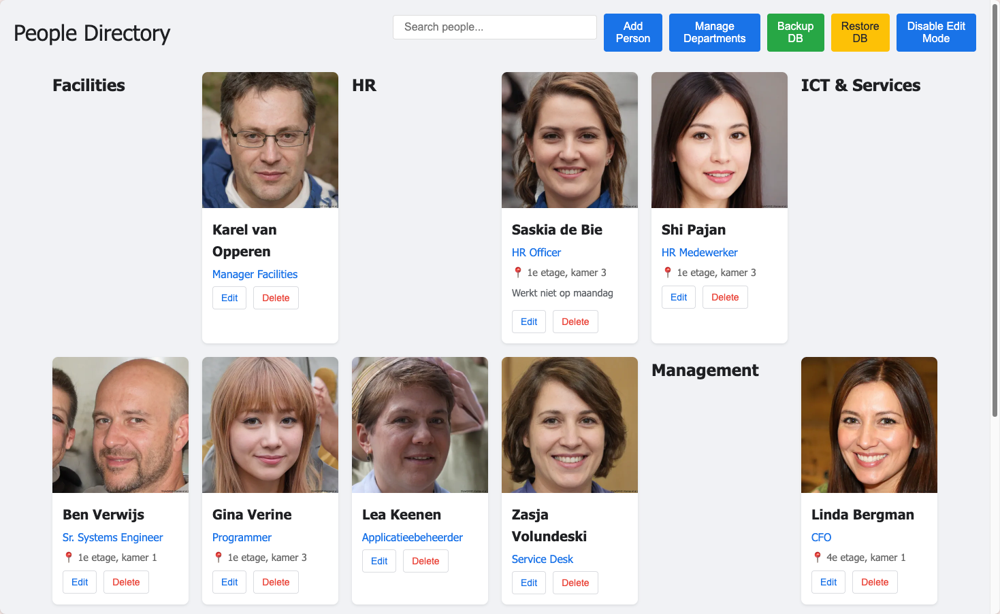

# People Directory

A privacy-first employee directory application built with vanilla HTML and JavaScript that runs entirely in your browser without requiring any server infrastructure.



## Usage
Open the [People Directory from Github Pages](https://tonsnoei.github.io/people-directory/)

## 🔒 Privacy & GDPR Compliance

This application is designed with privacy at its core:
- **No server required** - runs directly from your filesystem
- **No data transmission** - all information stays on your device
- **No external dependencies** - works completely offline
- **Full data control** - you own and control all employee data
- **GDPR friendly** - no third-party data processing or storage

Perfect for managing your team's directory with complete privacy, including downloading and storing colleague photos from LinkedIn without any compliance concerns.

## ✨ Features

- **🏢 Department Management** - Organize employees by departments
- **📸 Image Upload & Resize** - Upload photos that are automatically resized to 400x400 pixels
- **📍 Location** - Add location information for each employee
- **📝 Descriptions** - Include detailed descriptions and notes
- **💾 Data Export/Import** - Backup and restore your directory data
- **🔄 No Installation Required** - Run directly from the GitHub repository

## 🚀 Quick Start

1. **Clone or download this repository**
   ```bash
   git clone https://github.com/tonsnoei/people-directory.git
   ```

2. **Open the application**
   - Simply open `index.html` in your web browser
   - No web server or installation required

3. **Start adding employees**
   - Click "Add Employee" to create your first entry
   - Upload photos, assign departments, and add details
   - All data is automatically saved to your browser's IndexedDB

## 🛠️ Technical Details

- **Frontend**: Vanilla HTML5, CSS3, and JavaScript
- **Storage**: IndexedDB for local browser storage
- **Image Processing**: Automatic resizing to 400x400 pixels
- **Data Format**: JSON export/import for easy backup and migration
- **Browser Compatibility**: Works in all modern browsers

## 📊 Data Management

### Export Data
- Click the "Export" button to download your directory as a JSON file
- Use this for backups or migrating to another device

### Import Data
- Click the "Import" button to upload a previously exported JSON file
- Existing data will be merged with imported data

## 🔧 File Structure

```
people-directory/
├── index.html          # Main application file
├── styles.css          # Application styling
├── script.js           # Core JavaScript functionality
├── README.md           # This documentation
└── assets/             # Static assets (if any)
```

## 🌐 Browser Support

- Chrome 58+
- Firefox 55+
- Safari 11+
- Edge 79+

## 📝 Usage Tips

1. **Regular Backups**: Export your data regularly to prevent loss
2. **Image Optimization**: While images are resized automatically, smaller original files load faster
3. **Department Structure**: Plan your department hierarchy before adding many employees
4. **Data Migration**: Use export/import to move data between devices or browsers

## 🤝 Contributing

Feel free to submit issues, feature requests, or pull requests to improve the application.

## 📄 License

This project is open source and available under the [MIT License](LICENSE).

## 🔐 Privacy Statement

This application:
- Does not collect any personal data
- Does not transmit data to external servers
- Stores all data locally in your browser
- Gives you complete control over your data
- Can be used entirely offline

Your privacy is guaranteed by design, not just by policy.


# Development
Created using [Aider](https://aider.chat/) and [Openrouter](https://openrouter.ai/)

```bash
export OPENROUTER_API_KEY=sk-or-v1-....
aider --model openrouter/deepseek/deepseek-r1-0528:free
```